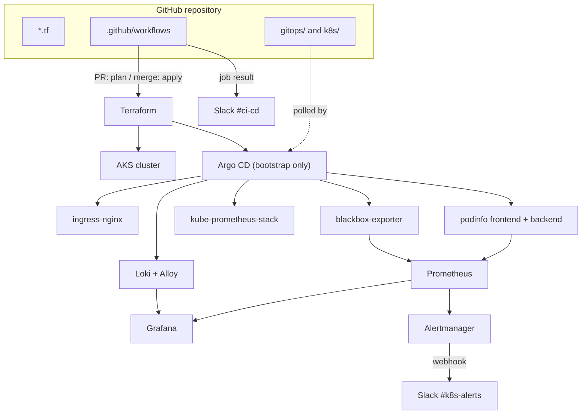

# AKS cluster with GitOps and full observability

A hands-on infrastructure project: an Azure Kubernetes Service cluster provisioned
with Terraform, everything inside it managed declaratively by Argo CD, and a
complete metrics + logs + probing stack wired to Slack alerting.

Built on an Azure free trial over ~8 days. The cluster has since been destroyed —
this repository is what recreates it.

## Architecture



Two independent delivery paths:

- **Terraform** owns everything *underneath* the cluster: resource group, AKS, and a
  single bootstrap Helm release for Argo CD.
- **Argo CD** owns everything *inside* the cluster. After the one-time bootstrap,
  no component is ever installed by hand — a new file in `gitops/apps/` is the
  only way anything reaches the cluster.

## Stack

| Component | Version | Purpose |
|---|---|---|
| AKS | 1.35 | 2 × Standard_B2s_v2, kubenet, Poland Central |
| Argo CD | chart 10.3.0 | GitOps controller, app-of-apps pattern |
| ingress-nginx | chart 4.11.0 | HTTP ingress, Azure LoadBalancer |
| podinfo | chart 6.14.1 | Demo frontend + backend, exposes RED metrics |
| kube-prometheus-stack | chart 88.2.0 | Prometheus, Grafana, Alertmanager, exporters |
| Loki | chart 7.3.0 | Log store, SingleBinary mode on a PVC |
| Grafana Alloy | chart 1.11.1 | Log collection DaemonSet |
| blackbox-exporter | chart 11.17.2 | External HTTP probing |

## Repository layout

```
main.tf, providers.tf          Terraform: resource group, AKS, Argo CD bootstrap
.github/workflows/main.yaml    plan on PR, apply on merge, manual destroy
gitops/root.yaml               root Application (app-of-apps)
gitops/apps/*.yaml             one Application per component
k8s/monitoring/dashboards/     Grafana dashboards as ConfigMaps
k8s/monitoring/alerting/       Probe and PrometheusRule definitions
```

## How it works

**Infrastructure.** Pushing a `*.tf` change to `main` runs `terraform apply`.
Opening a pull request runs `terraform plan` only. State lives in an Azure Storage
account outside this configuration. A `workflow_dispatch` trigger offers manual
plan / apply / destroy.

**Applications.** `gitops/root.yaml` is applied once by hand after the cluster
exists. It watches `gitops/apps/`, so every other Application — including
ingress-nginx itself — arrives through Git. Adding a component means adding a file.

**Dashboards as code.** Grafana runs without persistence. Dashboards live as JSON
inside ConfigMaps labelled `grafana_dashboard: "1"`; a sidecar picks them up
automatically. Nothing is created through the Grafana UI, so nothing is lost when
the pod restarts.

**Alerting.** blackbox-exporter probes the public URLs from outside the cluster,
verifying the whole path — DNS, load balancer, ingress, pod — rather than pod
liveness. Alert rules cover probe failure, slow responses, unexpected status codes,
error rate and p95 latency. Alertmanager delivers to Slack with resolved
notifications enabled.

## Bootstrap

The cluster is reproducible from this repository except for two secrets, which are
deliberately not committed:

1. **`alertmanager-slack`** — a Kubernetes Secret in the `monitoring` namespace
   holding the Slack webhook URL. Alertmanager reads it through
   `slack_api_url_file`. The Alertmanager pod will not start without it.

   ```
   kubectl -n monitoring create secret generic alertmanager-slack \
     --from-literal=webhook-url=<slack webhook url>
   ```

2. **`SLACK_WEBHOOK_CICD`** — a GitHub Actions repository secret used by the
   pipeline notification step.

Order of operations from an empty subscription:

1. Configure `ARM_*` repository secrets for the service principal.
2. Push to `main` — Terraform creates the resource group, AKS and Argo CD.
3. Add a read-only fine-grained PAT to Argo CD as a repository credential.
4. `kubectl apply -f gitops/root.yaml` — the only manual apply in the project.
5. Create the two secrets above.

## Known limitations

Deliberate trade-offs for a short-lived learning cluster, listed because they are
the difference between this and a production setup:

- **`apply -auto-approve` on every push to `main`.** No approval gate and no saved
  plan artifact, so `apply` re-plans rather than executing the reviewed diff. This
  is genuinely dangerous: `default_node_pool.vm_size` is a ForceNew attribute, so a
  one-word change would have destroyed and recreated the whole cluster unattended.
  A production version needs `plan -out`, an artifact, and a GitHub Environment with
  required reviewers.
- **Service principal secret instead of OIDC federation.** A long-lived credential
  in GitHub Secrets where a short-lived federated token would do.
- **Two secrets outside Git.** Documented above, but still manual. The right answer
  is External Secrets Operator backed by Azure Key Vault.
- **No external dead man's switch.** The `Watchdog` alert is routed to a null
  receiver. During this project Alertmanager silently failed to deliver for 17
  minutes; nothing would have reported that, because an alert about broken alerting
  cannot be delivered by the broken channel.
- **No TLS.** Everything is plain HTTP over `nip.io` hostnames. cert-manager with
  Let's Encrypt would need a real domain.
- **Hardcoded values, kubenet networking, single node pool.** No `variables.tf`;
  kubenet is being retired in favour of Azure CNI Overlay; the 4 vCPU trial quota
  ruled out a second node pool.

## Cost

Roughly under $1/day on Azure free trial credit: 2 burstable B2s_v2 nodes, a
standard load balancer, and three managed disks (Prometheus 10Gi, Loki 10Gi,
Alertmanager 2Gi).